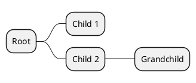

# Mind Map Converter

## Overview
This project provides a Python script (`mindmapconverter.py`) to facilitate the conversion between Freeplane/Freemind XML mind map files (`.mm`) and PlantUML mind map definitions (`.puml`). This enables users to leverage Freeplane/Freemind for visual mind map creation and then convert these maps into a PlantUML format suitable for embedding in documentation, especially in environments that support PlantUML rendering (e.g., GitLab, Confluence, Markdown viewers with Kroki integration).

## Features
- Convert Freeplane/Freemind (`.mm`) to PlantUML (`.puml`).
- Convert PlantUML (`.puml`) to Freeplane/Freemind (`.mm`).
- Supports both standard PlantUML syntax (`* Node`) and legacy underscore syntax (`*_ Node`).
- Command-line interface with proper argument parsing.

## Installation

### Prerequisites
- Python 3.x

### Steps
1. Clone the repository:
   ```bash
   git clone https://github.com/your-username/mindmapconverter.git
   cd mindmapconverter
   ```
2. (Optional) Create and activate a virtual environment:
   ```bash
   python -m venv venv
   source venv/bin/activate  # On Windows use `venv\Scripts\activate`
   ```

## Usage

The script automatically detects the conversion direction based on the input file's extension.

### Command Line Interface

```bash
python mindmapconverter.py input_file [-o output_file]
```

### Converting Freeplane/Freemind to PlantUML

To convert a Freeplane/Freemind `.mm` file to PlantUML:

```bash
python mindmapconverter.py input_file.mm -o output_file.puml
```

**Example:**
```bash
python mindmapconverter.py my_mindmap.mm -o my_mindmap.puml
```

If `-o` is omitted, the output is printed to stdout:
```bash
python mindmapconverter.py my_mindmap.mm > my_mindmap.puml
```

### Converting PlantUML to Freeplane/Freemind

To convert a PlantUML `.puml` file to Freeplane/Freemind XML:

```bash
python mindmapconverter.py input_file.puml -o output_file.mm
```

**Example:**
```bash
python mindmapconverter.py my_mindmap.puml -o my_mindmap.mm
```

### Supported Syntax
The converter supports the standard PlantUML MindMap syntax using asterisks for hierarchy:

It also supports the legacy syntax with underscores (`*_ Node`).

## Testing
To run the included unit tests:

```bash
python3 test_mindmapconverter.py
```

## Contributing
Contributions are welcome! If you have suggestions for improvements, bug reports, or want to add new features, please feel free to:
1. Fork the repository.
2. Create a new branch (`git checkout -b feature/YourFeature`).
3. Make your changes and add tests.
4. Commit your changes (`git commit -m 'Add some feature'`).
5. Push to the branch (`git push origin feature/YourFeature`).
6. Open a Pull Request.

## License
This project is licensed under the [MIT License](LICENSE).
