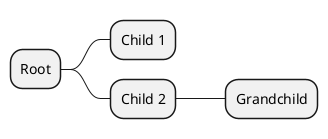

# Mind Map Converter

## Overview
This project provides a Python script (`mindmapconverter.py`) to facilitate the conversion between Freeplane/Freemind XML mind map files (`.mm`), PlantUML mind map definitions (`.puml`), and Markdown nested lists (`.md`). This enables users to leverage Freeplane/Freemind for visual mind map creation and then convert these maps into formats suitable for embedding in documentation, especially in environments that support PlantUML rendering (e.g., GitLab, Confluence, Markdown viewers with Kroki integration) or plain Markdown workflows.

## Features
- Convert Freeplane/Freemind (`.mm`) to PlantUML (`.puml`).
- Convert PlantUML (`.puml`) to Freeplane/Freemind (`.mm`).
- Convert Freeplane/Freemind (`.mm`) to Markdown nested lists (`.md`).
- Convert Markdown nested lists (`.md`) to Freeplane/Freemind (`.mm`).
- Supports both standard PlantUML syntax (`* Node`) and legacy underscore syntax (`*_ Node`).
- Hyperlink support across all formats.
- Command-line interface with proper argument parsing and auto-detection.

## Installation

### Prerequisites
- Python 3.x

### From PyPI
```bash
pip install mindmapconverter
```

### From Source
1. Clone the repository:
   ```bash
   git clone https://github.com/larkly/mindmapconverter.git
   cd mindmapconverter
   ```
2. Install the package:
   ```bash
   pip install .
   ```
   Or for development (editable mode):
   ```bash
   pip install -e .
   ```

## Usage

The script automatically detects the conversion direction based on the input file's extension. You can also use explicit flags to control the conversion.

### Command Line Interface

```bash
python mindmapconverter.py input_file [-o output_file] [--to-md] [--from-md]
```

### Converting Freeplane/Freemind to PlantUML

To convert a Freeplane/Freemind `.mm` file to PlantUML:

```bash
python mindmapconverter.py input_file.mm -o output_file.puml
```

**Example:**
```bash
python mindmapconverter.py my_mindmap.mm -o my_mindmap.puml
```

If `-o` is omitted, the output is printed to stdout:
```bash
python mindmapconverter.py my_mindmap.mm > my_mindmap.puml
```

### Converting PlantUML to Freeplane/Freemind

To convert a PlantUML `.puml` file to Freeplane/Freemind XML:

```bash
python mindmapconverter.py input_file.puml -o output_file.mm
```

**Example:**
```bash
python mindmapconverter.py my_mindmap.puml -o my_mindmap.mm
```

### Converting Freeplane/Freemind to Markdown

To convert a `.mm` file to a Markdown nested list:

```bash
python mindmapconverter.py input_file.mm --to-md -o output_file.md
```

Auto-detected when the output file has a `.md` extension:
```bash
python mindmapconverter.py my_mindmap.mm -o my_mindmap.md
```

### Converting Markdown to Freeplane/Freemind

To convert a Markdown file to Freemind XML:

```bash
python mindmapconverter.py input_file.md -o output_file.mm
```

The `.md` extension is auto-detected, or you can use `--from-md` explicitly:
```bash
python mindmapconverter.py notes.md --from-md -o notes.mm
```

### Markdown Format Specification

The Markdown mindmap format uses the following conventions:

- **Root node**: The first `# H1` header becomes the root of the mindmap.
- **Child nodes**: Nested unordered list items (`-`, `*`, or `+` markers) represent child nodes.
- **Hierarchy**: Indentation (2 spaces per level) determines the depth of each node.
- **Links**: `[text](url)` Markdown links are converted to Freemind hyperlinks (hook elements).
- **Multiline text**: `<br>` tags in list items are converted to newlines in node text.

**Example Markdown:**
```markdown
# Project Plan
- Phase 1
  - Design
  - Prototype
- Phase 2
  - [Documentation](http://docs.example.com)
  - Testing
    - Unit Tests
    - Integration Tests
```

### Supported Syntax
The converter supports the standard PlantUML MindMap syntax using asterisks for hierarchy:

```plantuml
@startmindmap
* Root
** Child 1
** Child 2
*** Grandchild
@endmindmap
```
It also supports the legacy syntax with underscores (`*_ Node`).

## Testing
To run the included unit tests:

```bash
python3 test_mindmapconverter.py
```

## Contributing
Contributions are welcome! If you have suggestions for improvements, bug reports, or want to add new features, please feel free to:
1. Fork the repository.
2. Create a new branch (`git checkout -b feature/YourFeature`).
3. Make your changes and add tests.
4. Commit your changes (`git commit -m 'Add some feature'`).
5. Push to the branch (`git push origin feature/YourFeature`).
6. Open a Pull Request.

## License
This project is licensed under the [MIT License](LICENSE).
